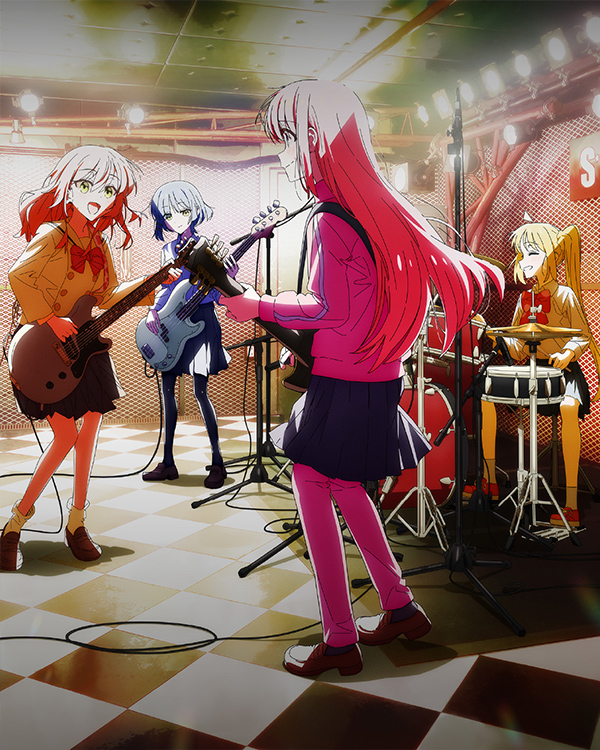

## 👋 Welcome to My GitHub!

Hello! I'm Zesion.

## 🚀 Tech Stack

## 📈 Stats

<!--## 📚 Projects
- **[Project Name]**: A brief description. [Link](#)-->

## 📬 Contact

- Website: [http://zesionlee.cn](http://zesionlee.cn)
- Email: zechen21@foxmail.com
- Bilibili: (https://space.bilibili.com/32763783)

## 📺 Anime Recommendations

Here are some of my favorite anime series that I highly recommend! 🎬

- [**ぼっち・ざ・ろっく！**](https://ani.gamer.com.tw/animeVideo.php?sn=31599)

  

- [**真夜中ぱんチ**](https://ani.gamer.com.tw/animeVideo.php?sn=38831)

  

- [**日々は過ぎれど飯うまし**](https://ani.gamer.com.tw/animeVideo.php?sn=42917)

  

<!--
**zesion21/zesion21** is a ✨ _special_ ✨ repository because its `README.md` (this file) appears on your GitHub profile.

Here are some ideas to get you started:

- 🔭 I’m currently working on ...
- 🌱 I’m currently learning ...
- 👯 I’m looking to collaborate on ...
- 🤔 I’m looking for help with ...
- 💬 Ask me about ...
- 📫 How to reach me: ...
- 😄 Pronouns: ...
- ⚡ Fun fact: ...
-->
